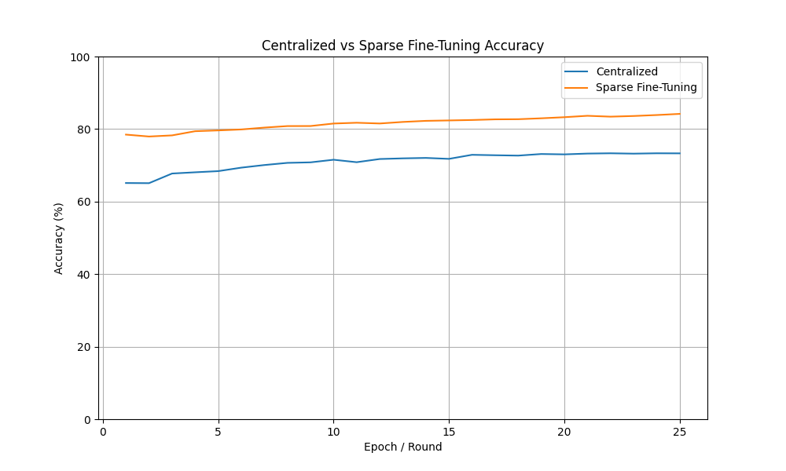
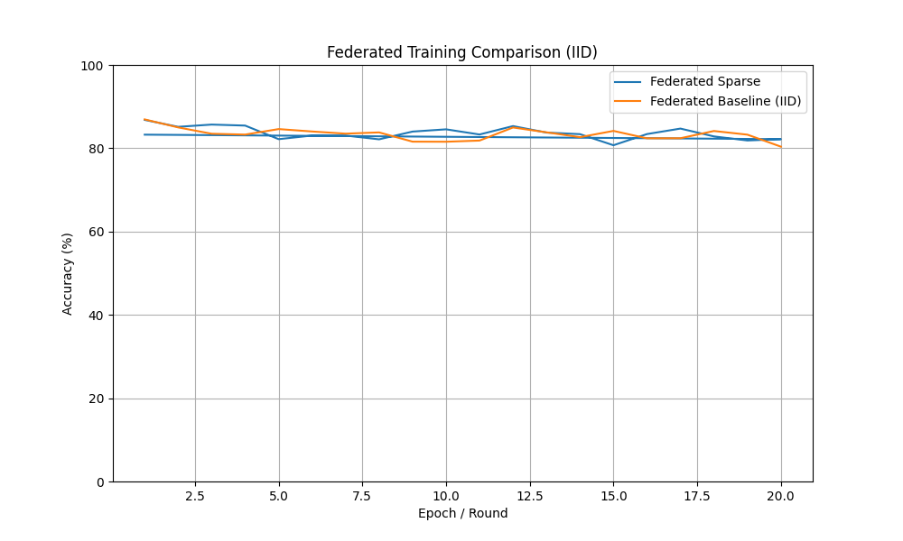
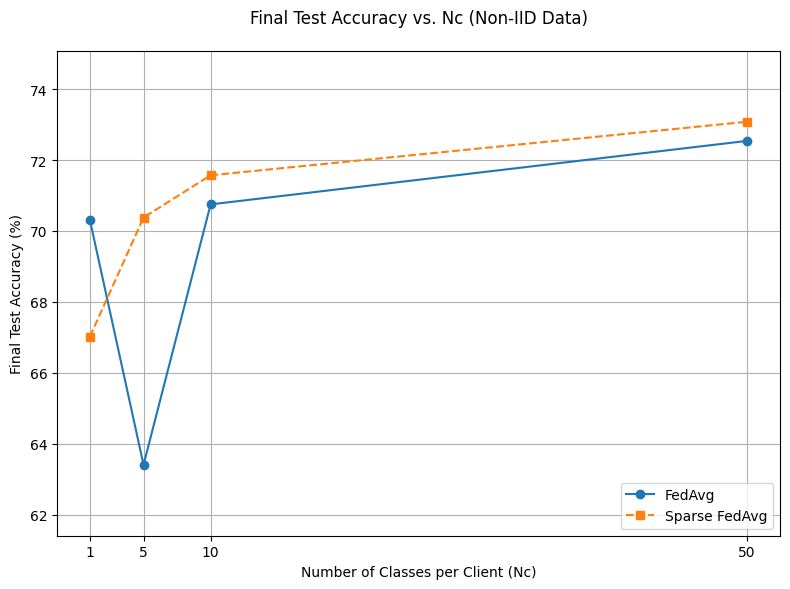

# Sparse Federated Learning on CIFAR-100

This repository presents a cleaned portfolio version of a university project on sparse federated learning for image classification.

The project investigates centralized training, standard Federated Averaging and sparse Federated Averaging on the CIFAR-100 dataset using a DINO ViT-S/16 backbone.

The main goal is to evaluate whether sparse updates can reduce communication and computational costs in federated learning while maintaining competitive classification performance. The project also includes a simple secure aggregation mechanism based on zero-sum noise masking to protect individual client updates during aggregation.

---

## Project overview

Federated Learning allows multiple clients to collaboratively train a shared model without directly sharing their local data. This is especially relevant in contexts where data privacy, decentralization or communication efficiency are important.

However, federated learning introduces several challenges:

- client data may be non-IID;
- local models may diverge across clients;
- communication between clients and server can be expensive;
- individual model updates may reveal sensitive information.

This project explores two main ideas:

1. **Sparse federated learning**  
   Only a subset of model parameters or gradients is updated and transmitted, reducing communication overhead.

2. **Secure aggregation**  
   Client updates are masked with coordinated zero-sum noise so that the server can recover the correct aggregate update while remaining blind to individual client contributions.

---

## Main analytical components

The original project included:

- centralized image classification on CIFAR-100;
- sparse fine-tuning with gradient masking;
- standard Federated Averaging;
- sparse Federated Averaging;
- IID and non-IID client data partitions;
- evaluation of final test accuracy across training configurations;
- secure aggregation through zero-sum noise masking.

---

## Model and dataset

### Dataset

The project uses the CIFAR-100 dataset, which contains 60,000 images across 100 classes.

The dataset is not included in this repository. It can be downloaded automatically through `torchvision`.

### Model

The model is based on a DINO ViT-S/16 backbone used as a frozen feature extractor, with a trainable classification head for CIFAR-100 classification.

---

## Visual overview

### Centralized vs sparse fine-tuning



### Federated training under IID data



### Final accuracy under non-IID settings



---

## Repository structure

```text
sparse-federated-learning-cifar100/
├── data/
├── figures/
│   ├── centralized_vs_sparse.png
│   ├── federated_iid_comparison.png
│   └── non_iid_final_accuracy.png
├── notebooks/
│   └── 01_federated_learning_demo.ipynb
├── reports/
│   ├── project_summary.md
│   ├── final_test_results.csv
│   └── results_summary.md
├── scripts/
│   └── run_toy_secure_aggregation.py
├── src/
│   ├── __init__.py
│   ├── data_utils.py
│   ├── federated.py
│   ├── model.py
│   ├── model_saver.py
│   ├── secure_aggregation.py
│   ├── sparse_utils.py
│   └── training.py
├── README.md
├── requirements.txt
└── .gitignore
```

---

## Demo notebook

The repository includes one public demo notebook:

[`notebooks/01_federated_learning_demo.ipynb`](notebooks/01_federated_learning_demo.ipynb)

The notebook provides a readable demonstration of the main project components:

- centralized learning setup;
- client partitioning;
- IID and non-IID data simulation;
- Federated Averaging logic;
- sparse update masking;
- secure aggregation concept;
- final result interpretation.

The notebook is designed for portfolio presentation and does not require storing large model checkpoints in the repository.

---

## Reusable Python modules

The `src/` folder contains reusable Python modules extracted from the cleaned project structure.

- `data_utils.py`  
  Utilities for loading CIFAR-100 and creating client partitions.

- `model.py`  
  Model definition based on a DINO ViT backbone and classification head.

- `training.py`  
  Training and evaluation utilities.

- `federated.py`  
  Federated Averaging and client-server training logic.

- `sparse_utils.py`  
  Utilities for sparse update masking and sparse fine-tuning.

- `secure_aggregation.py`  
  Zero-sum noise masking for secure aggregation of client updates.

- `model_saver.py`  
  Utilities for model saving and checkpoint management.

---

## Results summary

The experiments compare centralized training, sparse fine-tuning and federated learning configurations.

The project evaluates:

- centralized training as the reference upper-bound setting;
- sparse fine-tuning to study the effect of gradient masking;
- standard FedAvg under IID and non-IID client data distributions;
- sparse FedAvg to evaluate whether sparse updates can retain competitive performance;
- secure aggregation as an additional privacy-preserving aggregation layer.

Detailed final results are available in:

- [`reports/final_test_results.csv`](reports/final_test_results.csv)
- [`reports/results_summary.md`](reports/results_summary.md)

---

## Secure aggregation

A simple secure aggregation mechanism is implemented using zero-sum noise masking.

The idea is that each client adds a noise vector to its model update before sending it to the server. The noise vectors are constructed so that they cancel out when aggregated across clients.

As a result:

- the server receives masked individual updates;
- the aggregate update remains correct;
- individual client contributions are harder to inspect directly;
- the mechanism is compatible with sparse updates.

This implementation is intended as a simple educational demonstration of the secure aggregation principle, not as a production-grade cryptographic protocol.

---

## Running the project

Clone the repository:

```bash
git clone https://github.com/lorenzodegregorio/sparse-federated-learning-cifar100.git
cd sparse-federated-learning-cifar100
```

Create and activate a virtual environment:

```bash
python -m venv .venv
```

On Windows:

```bash
.venv\Scripts\activate
```

On macOS/Linux:

```bash
source .venv/bin/activate
```

Install dependencies:

```bash
pip install -r requirements.txt
```

Run the toy secure aggregation demo:

```bash
python scripts/run_toy_secure_aggregation.py
```

Or open the notebook:

```bash
jupyter notebook
```

---

## Data and checkpoints

The CIFAR-100 dataset is not included in this repository.

Large files such as downloaded datasets, model checkpoints, training runs and experiment logs are intentionally excluded through `.gitignore`.

Excluded files include:

- CIFAR-100 raw data;
- `.pt`, `.pth` and `.ckpt` model checkpoints;
- training logs;
- output folders;
- cache folders;
- local experiment artifacts.

This keeps the repository lightweight and focused on the public portfolio version of the project.

---

## Technical keywords

`Python` · `PyTorch` · `torchvision` · `Federated Learning` · `FedAvg` · `Sparse Training` · `Secure Aggregation` · `CIFAR-100` · `Vision Transformer` · `DINO ViT` · `Non-IID Data` · `Deep Learning` · `Privacy-preserving Machine Learning`

---

## Project status

This repository is a cleaned and public-facing portfolio version of a university project.

It is intended to demonstrate the methodological structure, coding style and analytical reasoning behind the original work, without including large datasets, checkpoints or raw experiment folders.
